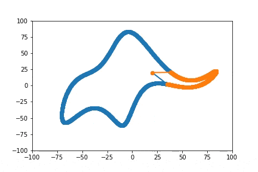

# fourier-elephant
 "With four parameters I can fit an elephant, and with five I can make him wiggle his trunk"
 python 3 code implementation of "Drawing an elephant with four complex parameters" (2010) using new matplotlib animations.
 To create movie, ffmpeg must be installed 
 
 
https://ffmpeg.org/download.html#build-windows

before running elephan.py from ipython, run the following magic command to change engine to qt5  

import matplotlib  
%matplotlib qt5

after running elephan.py, you should see this animation:

